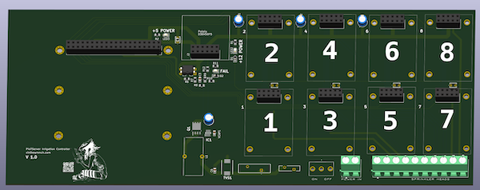

# GardenIrrigation

This is the hardware for Farm automation made easy as Pi

Garden Irrigation Board

<object data="Garden PCB schematic.pdf" type="application/pdf" width="600px" height="500px">
    <embed src="Garden PCB schematic.pdf">
        
This browser does not support PDFs. Please download the PDF to view it: <a href="Garden PCB schematic.pdf">Download PDF</a>.

    </embed>
</object>

DRV103 Plugin Board

<object data="DRV103 Solenoid Driver Board.pdf" type="application/pdf" width="600px" height="500px">
    <embed src="DRV103 Solenoid Driver Board.pdf">
        
This browser does not support PDFs. Please download the PDF to view it: <a href="DRV103 Solenoid Driver Board.pdf">Download PDF</a>.

    </embed>
</object>

# Articles

* [Farm automation made easy as Pi](https://www.vinthewrench.com/p/raspberry-pi-internet-of-things-part)
* [Controlling the Irrigation valves.](https://www.vinthewrench.com/p/raspberry-pi-internet-of-things-part-23c)
* [Reading the Temperature with 1-wire Sensors](https://www.vinthewrench.com/p/raspberry-pi-internet-of-things-part-a4c)
* [Using the I2C protocol to communicate to sensors.](https://www.vinthewrench.com/p/raspberry-pi-internet-of-things-part-688)
* [Reading Environmental Data with I2C](https://www.vinthewrench.com/p/raspberry-pi-internet-of-things-part-a03)
* [Rain Sensors](https://www.vinthewrench.com/p/raspberry-pi-internet-of-things-part-cfd)
* [More I/O](https://www.vinthewrench.com/p/raspberry-pi-internet-of-things-part-61b)
* [Getting the data and controlling the devices from the REST API](https://www.vinthewrench.com/p/raspberry-pi-internet-of-things-part-8e7)
* [Writing your own device plug-ins](https://www.vinthewrench.com/p/raspberry-pi-internet-of-things-part-9ef)
* [Using software devices to build on the hardware.](https://www.vinthewrench.com/p/raspberry-pi-internet-of-things-part-094)
* [How to make things happen automatically](https://www.vinthewrench.com/p/raspberry-pi-internet-of-things-part-12f)
* [How to make things happen on time](https://www.vinthewrench.com/p/raspberry-pi-internet-of-things-part-eb8)
* [There are always conditions to evaluate](https://www.vinthewrench.com/p/raspberry-pi-internet-of-things-part-3aa)
* [Rolling my own I²C and 1-Wire interface card](https://www.vinthewrench.com/p/raspberry-pi-internet-of-things-part-2a8)
 
 